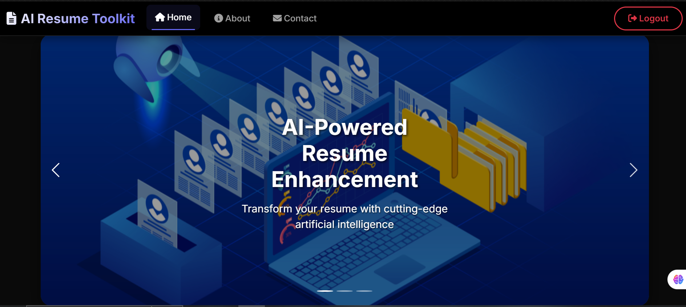
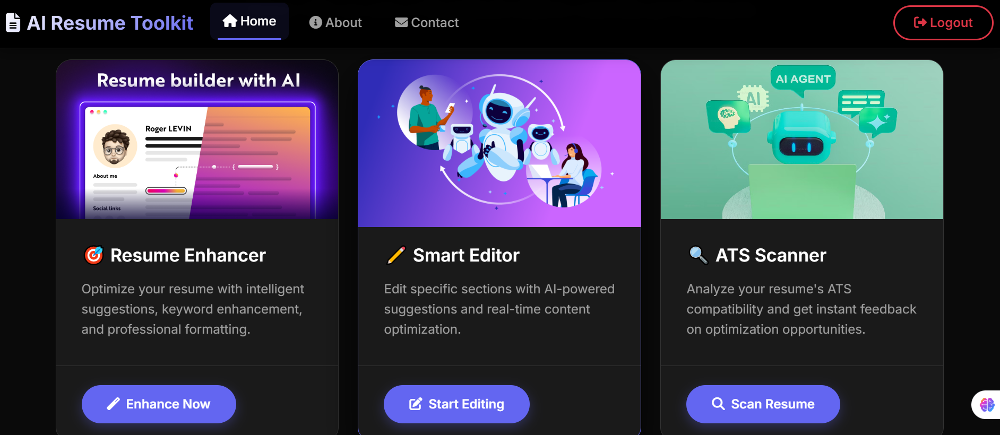

# AI Resume Toolkit

A Django-based web application that helps job seekers enhance their resumes using artificial intelligence. The toolkit provides three main features: full resume enhancement, section-specific improvements, and ATS (Applicant Tracking System) compatibility scanning.



## What This Project Does

This application helps you create better resumes by analyzing them against job descriptions and providing AI-powered improvements. Whether you need to rewrite your entire resume, polish a specific section, or check how well it matches a job posting, this toolkit has you covered.

### Key Features

**Resume Enhancer** - Upload your resume text along with a job description, and the system uses a team of AI agents to analyze gaps, rewrite content with powerful keywords, and format everything professionally. The AI crew includes a talent analyst who identifies what's missing, a content writer who crafts compelling achievements, and an editor who ensures everything looks polished.

**Section Enhancer** - Sometimes you only need to improve one part of your resume. Upload your PDF, select a section like "Experience" or "Skills," and get an enhanced version of just that section. This is perfect for quick updates without redoing your entire resume.

**ATS Scanner** - Before submitting your resume, check how it performs with applicant tracking systems. Upload your PDF and the job description, then choose between two evaluations: an HR manager's perspective that highlights strengths and weaknesses, or an ATS compatibility score that shows your percentage match and missing keywords.

**User Management** - The application includes admin features for managing users. Administrators can add, edit, or remove user accounts, making it suitable for career centers or organizations serving multiple job seekers.



## How It Works

The application is built with Django and uses several AI models to provide intelligent feedback. For the full resume enhancement, it employs CrewAI with three specialized agents that work sequentially - each one building on the previous agent's work. The section enhancer and ATS scanner use language models from Groq to provide fast, focused analysis.

When you upload a resume PDF, the system extracts the text and sends it to the appropriate AI service along with your job description. The AI analyzes the content, identifies improvements, and returns enhanced text that you can copy and use immediately.

## Technology Stack

The project uses Django as the web framework with SQLite for the database. Authentication is handled through Django's built-in user system, with separate views for regular users and administrators. For PDF processing, it uses PyPDF and PyMuPDF libraries. The AI capabilities come from CrewAI for multi-agent workflows and Groq's language models for text analysis.

Templates are rendered using Django's template engine, and static files like images are served from a dedicated static folder. The application supports asynchronous operations for better performance when running AI tasks.

## Project Structure

The codebase is organized into two main Django apps. The `login_app` handles all user authentication, the AI-powered resume features, and admin functions. The `myapp` provides supporting pages like the home page, about section, services, and contact form.

Key files include `agents.py` which contains the CrewAI setup with three specialized agents, `section.py` for PDF section extraction and enhancement, and `ats_service.py` for the ATS scanning functionality. Views are defined in `views.py` files, with URL routing configured in the respective `urls.py` files.

## Getting Started

To run this project, you'll need Python installed along with Django and several AI libraries. Follow these steps:

1. **Get your Groq API Key** - Visit [Groq Console](https://console.groq.com/) and sign up for a free account. Navigate to the API Keys section and generate a new API key.

2. **Set up environment variables** - Create a `.env` file in the project root directory and add your API key:
   ```
   GROQ_API_KEY=your-groq-api-key-here
   ```

3. **Install dependencies** - Install all required packages using:
   ```bash
   pip install -r requirements.txt
   ```

4. **Run migrations** - Create the database tables:
   ```bash
   python manage.py migrate
   ```

5. **Start the server** - Launch the development server:
   ```bash
   python manage.py runserver
   ```

The application will be available at `http://localhost:8000` where you can register a new account and start using the resume enhancement tools.

## User Roles

The system supports two types of users. Regular users can access all resume enhancement features including the full enhancer, section enhancer, and ATS scanner. Admin users have additional privileges to manage other users, view all registered accounts, and access the Django admin panel.

## Important Notes

This is a development version with debug mode enabled. Before deploying to production, remember to change the secret key in settings, disable debug mode, configure proper allowed hosts, and set up a production-grade database. Also ensure your API keys are stored securely and never committed to version control.

The AI features require an active internet connection and valid API credentials. Processing times may vary depending on resume length and the complexity of the job description.

## Future Enhancements

Potential improvements could include support for multiple file formats beyond PDF, saving enhanced resumes directly to user accounts, comparison tools to track resume versions over time, and integration with additional AI models for more diverse feedback.

---

Built with Django and powered by AI to help job seekers land their dream roles.
